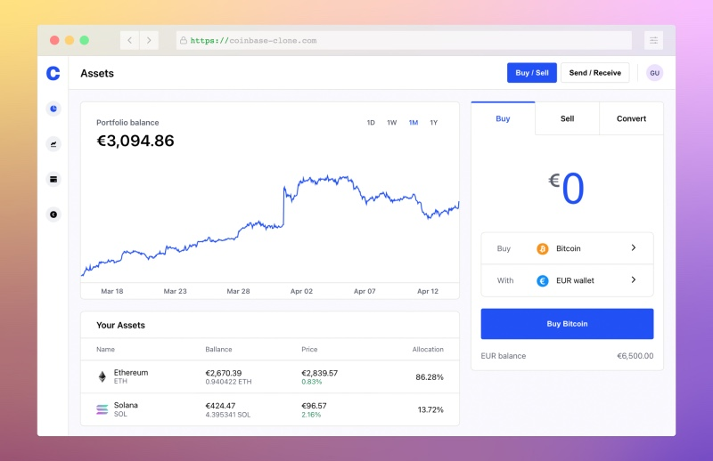
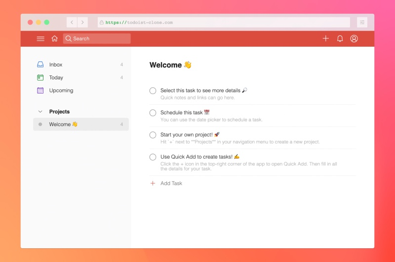

<h1> Hey! Nice to see you.</h1>

I'm Max, a fullstack engineer, and entrepreneur from  <b>Berlin, Germany.</b>

I co-founded <b>two companies</b> and have worked as an international business consultant 👔.

Then I discovered my true passion: <b>writing code</b> 💾.

<h2>Favorite technologies</h2>

  
  
  
  
  
  
  
  
  
  

<h2>Coding projects</h2>

  
  <table>
  <tbody>
    <tr>
      <td>
        
        <a href="https://coinbase-clone.com/">Go to live app</a> | <a href="https://github.com/maker0101/Coinbase_Clone">See code</a> | (Feb - Mar 2022)
        <h3>Coinbase Clone</h3>
        
Simplified Coinbase Clone built with React, JavaScript, and Firebase. Real-time data from Coinranking API.

      </td>
      <td>
        
        <a href="https://todoist-clone.com/">Go to live app</a> | <a href="https://github.com/maker0101/Todoist_Clone">See code</a> | (Dec 2021 - Jan 2022)
        <h3>Todoist Clone</h3> 
        
A simplified Todoist clone built with React and Firebase. End-to-End Testing with Cypress.

      </td>
    </tr>
  </tbody>
</table>

<h2>Contact me</h2>
<ul>
  <li>Website: <a href="https://www.maxbreitsprecher.com/">maxbreitsprecher.com</a></li>
  <li>Email: <a href='mailto:max.breitsp@gmail.com?subject=Hi%20Max%20👋'>max.breitsp@gmail.com</a></li>
  <li>Github profile: <a href="https://github.com/maker0101">github.com/maker0101</a></li>
</ul>
  
  

