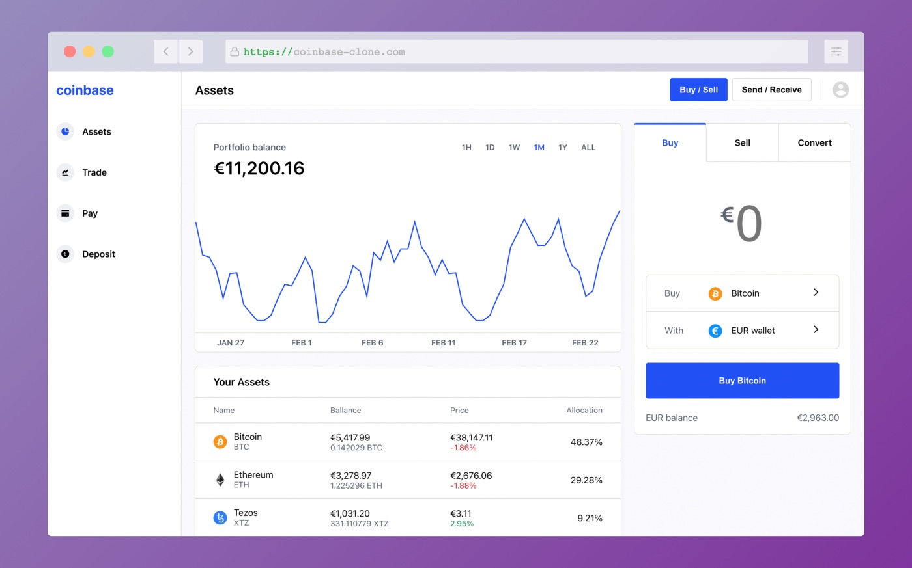
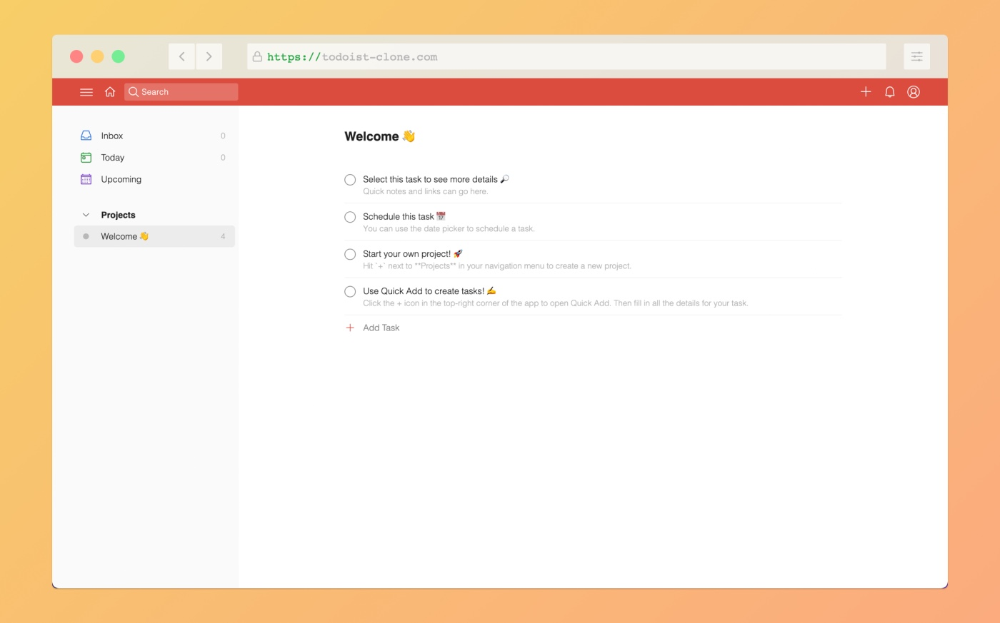

<h1> Hey! Nice to see you.</h1>

I'm Max, Frontend Developer and Entrepreneur from  <b>Berlin, Germany.</b>

Discovered my passion for coding somewhat late in life. Now that I did, I feel like a fish 🐟 in water 🌊.

<h3>Technologies</h3>

  
  
  
  
  
  
  
  
  
  
   
  
  
  
  

<h3>Currently exploring</h3>

  
  
  

<h3>Coding projects</h3>

  
  <table>
  <tbody>
    <tr>
      <td>
        
        <a href="https://google.com">Go to live app</a> | <a href="https://google.com">See code</a> | (Feb - Mar 2022)
        <h4>Coinbase Clone</h4>
        
Simplified Coinbase Clone build with React, Typescript and Firebase. Tested with Jest/React Testing Library.

      </td>
      <td>
        
        <a href="https://todoist-clone.com/">Go to live app</a> | <a href="https://github.com/maker0101/Todoist_Clone">See code</a> | (Dec 2021 - Jan 2022)
        <h4>Todoist Clone</h4> 
        
A simplified Todoist clone built with React and Firebase. End-to-End Testing with Cypress.

      </td>
    </tr>
  </tbody>
</table>
  
  

